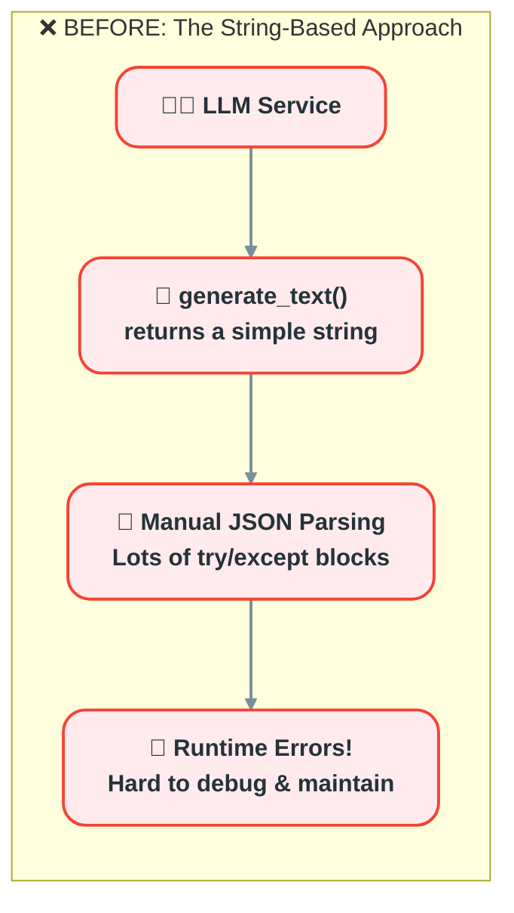
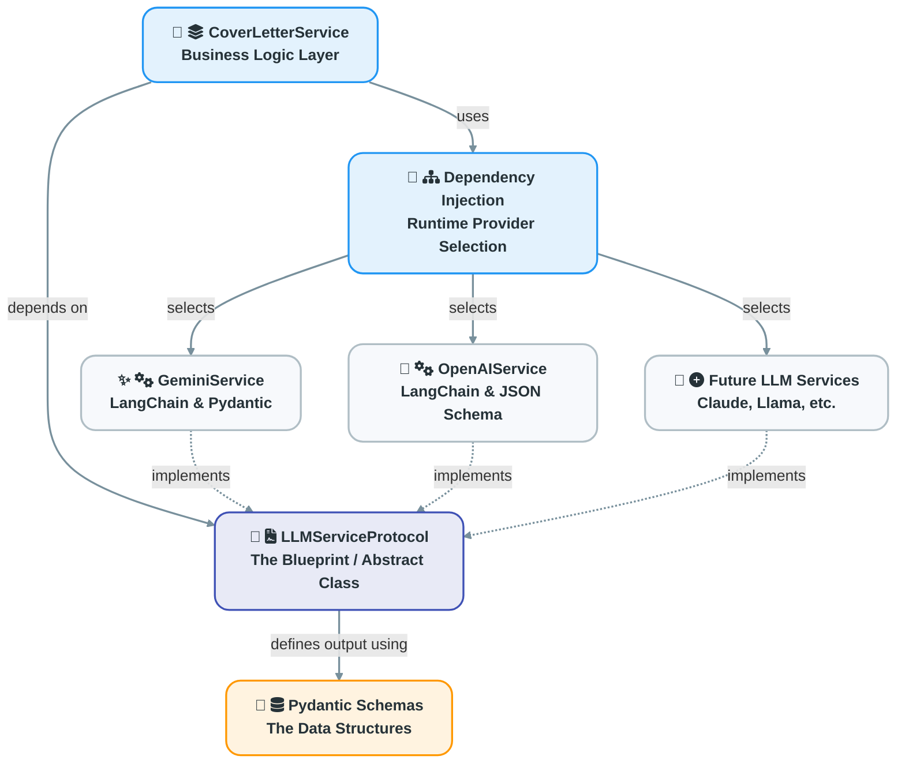
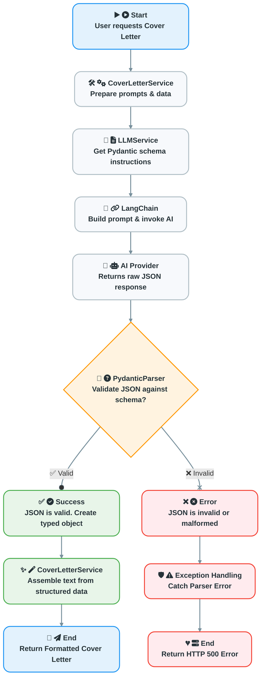
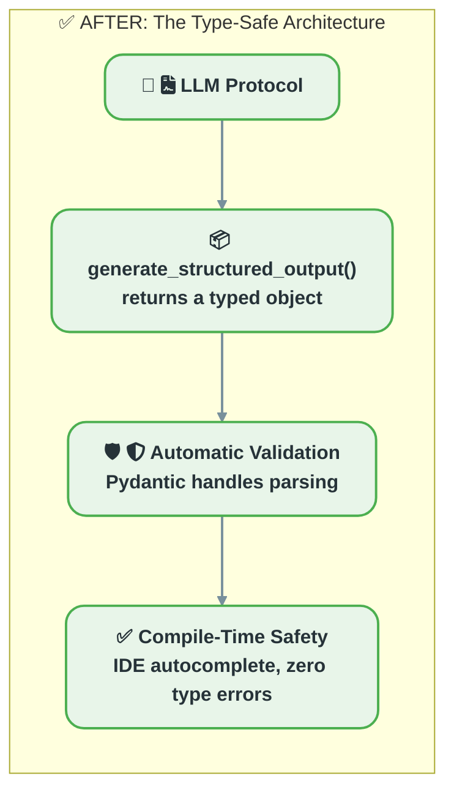

# Presentation Content

**Purpose:** This file contains only the clean script and diagrams, representing what the audience would see on slides or in a handout.

---

### **Project Overview: The AI Cover Letter Generator**

This project is a full-stack application designed to automate the creation of personalized cover letters. It analyzes a user's resume and a job description to generate tailored content, aiming to streamline the job application process.

---

### **Building a Type-Safe LLM Service Layer**

My goal was to move beyond simple string-based generation and create an architecture that is type-safe, swappable, and resilient to the unpredictable nature of AI responses.

---

### **The Problem: Unreliable by Default**

The core problem with LLMs is their non-deterministic output, which can lead to brittle systems and runtime errors.

This was the 'Before' state.



---

### **The Solution: A Protocol-Oriented Architecture**

I designed a new architecture based on **Abstraction**, **Dependency Injection**, and **Schema-Driven Development**.



Here is the code that makes this possible.

#### **1. The Protocol (The Contract)**

```python
# app/services/llm_service_protocol.py

class LLMServiceProtocol(ABC):
    @abstractmethod
    async def generate_structured_output(
        self,
        system_prompt: str,
        user_prompt: str,
        output_schema: Type[T_BaseModel],
        input_vars: Optional[Dict[str, Any]] = None,
    ) -> T_BaseModel:
        ...
```

#### **2. The Schema (The Data Structure)**

```python
# app/schemas/cover_letter.py

class CoverLetterStructure(BaseModel):
    """Schema defining the standard parts of a cover letter"""
    title: Optional[str]
    applicant_name: Optional[str]
    recipient_name: Optional[str]
    # ... other header fields ...

    # Body Fields
    greeting: Optional[str]
    introduction: Optional[str]
    skills: Optional[str]
    projects: Optional[str]
    company_fit: Optional[str]
    conclusion: Optional[str]
    closing: Optional[str]
```

---

### **The Process in Action**

Here is how it works in practice when a user wants to generate a cover letter.



Here's what that service call looks like.

#### **3. The Service Call (The Implementation)**

```python
# app/services/cover_letter_service.py

class CoverLetterService:
    def __init__(self, db: Session, llm_service: LLMServiceProtocol):
        self.db = db
        self.llm_service = llm_service

    async def generate_cover_letter_instance(self, ...):
        # ... build input_vars dictionary ...
        generated_data = await self.llm_service.generate_structured_output(
            system_prompt=cover_letter_prompts.COVER_LETTER_SYSTEM,
            user_prompt=cover_letter_prompts.COVER_LETTER_USER,
            input_vars=input_vars,
            output_schema=CoverLetterStructure,
        )
        # Assemble the final text from the structured data
        final_text = self._assemble_cover_letter_text(generated_data)
```

---

### **Reflection & Key Learnings**

The impact of this architecture is significant, moving the system from fragile to robust and predictable.



Key Learnings:
- **Protocols** for Abstraction
- **Schema-First** Development is Non-Negotiable
- **Testability & Scalability** are vastly improved

My key learnings were: the power of **Protocols for Abstraction**, that **Schema-First Development is Non-Negotiable**, and the massive improvements in **Testability and Scalability**. This investment in architecture has paid off immensely in terms of developer confidence and system reliability.

---

### **Thank You & Next Steps**

Thank you for watching. This protocol-oriented architecture provides a robust foundation for building reliable, maintainable, and scalable AI-driven features.

For a deeper look at the implementation, the complete source code is available on GitHub.
