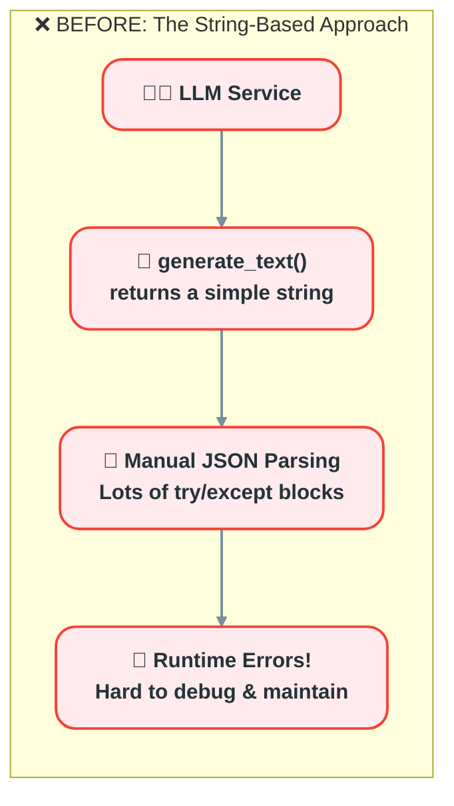
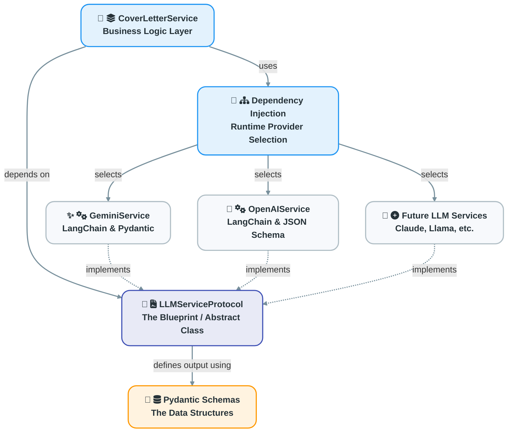
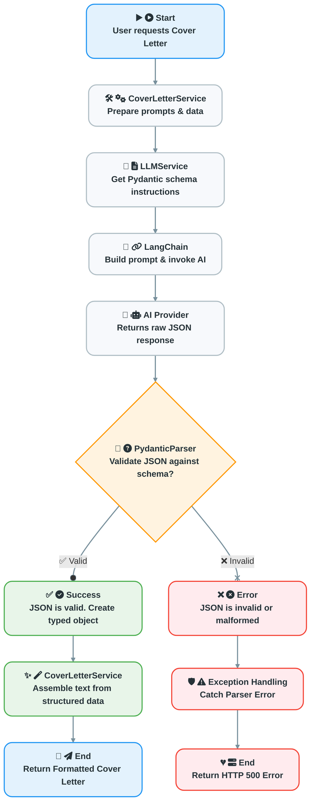
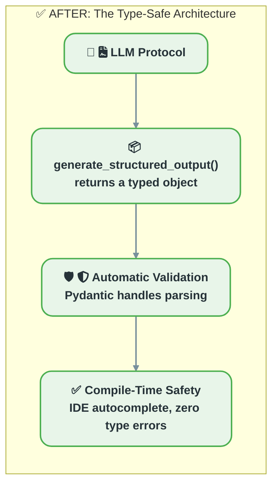

# Presentation Script (With Presenter Notes)

**Purpose:** Use this file for rehearsal. It contains your full script, cues for when to show diagrams, and detailed notes to ensure you cover all key points.

---

### **Slide 1: Title Slide**

**(Spoken Script)**

"This presentation details the architecture of a robust and maintainable `service layer` for an AI Cover Letter Generator. The primary objective was to solve for unpredictable `LLM outputs` by creating a `type-safe`, `modular`, and `resilient` system."

---

### **Slide 2: Project Overview**

**(Spoken Script)**

"The project is a `full-stack` AI Cover Letter Generator. It ingests a user's resume and a job description, then leverages an `LLM` to produce a tailored cover letter. The system is designed to create personalized, high-quality drafts."

---

### **Slide 3: The Problem - Unreliable by Default**

**(Spoken Script)**

"The central problem is the non-deterministic nature of `LLM outputs`. A naive implementation relying on direct `API calls` results in a brittle system prone to `runtime errors` from malformed responses. This diagram illustrates the initial, fragile approach."

**(➡️ ACTION: Show this diagram)**



**(Spoken Script)**

"As you can see, the process was simple but fragile. The service would get a raw string back, and the `business logic` became cluttered with complex parsing and `error handling`. This `tight coupling` meant that any small change in the `LLM's output format` could break the entire system, making it impossible to maintain or scale."

---

### **Slide 4: The Solution - A Protocol-Oriented Architecture**

**(Spoken Script)**

"The solution is an architecture based on three core principles: **`Abstraction`**, **`Dependency Injection`**, and **`Schema-Driven Development`**."

**(➡️ ACTION: Show this diagram)**



**(Spoken Script)**

"This diagram shows the `high-level design`. The `LLMServiceProtocol` `abstract interface` defines the contract for all `LLM interactions`. Concrete implementations, like a `GeminiService`, adhere to this contract. The `business logic` within the `CoverLetterService` is decoupled, depending only on the `protocol`. This enables provider swapping at `runtime` via **`Dependency Injection`**. System reliability is anchored by **`Pydantic Schemas`**, which define the expected `output data structures`.

The following code implements this design."

**(➡️ ACTION: Show these code snippets)**

#### **Code Snippet 1: The Protocol (The Contract)**

```python
# Location: app/services/llm_service_protocol.py

from abc import ABC, abstractmethod
from typing import Any, Dict, Optional, Type, TypeVar
from pydantic import BaseModel

T_BaseModel = TypeVar("T_BaseModel", bound=BaseModel)

class LLMServiceProtocol(ABC):
    """
    Protocol defining the interface for LLM services.
    """
    @abstractmethod
    async def generate_structured_output(
        self,
        system_prompt: str,
        user_prompt: str,
        output_schema: Type[T_BaseModel],
        input_vars: Optional[Dict[str, Any]] = None,
    ) -> T_BaseModel:
        """
        Asynchronously generates structured output from the LLM based on a Pydantic model.
        """
        ...
```

**(Presenter Notes - Technical Deep Dive)**

*   "I'm using `ABC` and `@abstractmethod` from Python's standard library to define a formal `interface`. This ensures that any class attempting to implement this `protocol` *must* provide a `concrete implementation` of `generate_structured_output`, otherwise a `TypeError` is raised at `instantiation time`. This is `compile-time checking` for our architecture."
*   "The use of `TypeVar("T_BaseModel", bound=BaseModel)` is key for `generic type safety`. It allows this method to work with *any* `Pydantic model`, while still allowing my IDE and `static analysis tools` like `Mypy` to understand that the `return type` will be an `instance` of the `output_schema` that was passed in."
*   "Notice the `async def`. This is critical. `LLM API calls` are `I/O-bound`. By making the contract `asynchronous`, I ensure that any implementation won't block the server's `event loop`, allowing the application to remain responsive and handle other requests while waiting for the `AI provider`."

#### **Code Snippet 2: The Schema (The Data Structure)**

```python
# Location: app/schemas/cover_letter.py

class CoverLetterStructure(BaseModel):
    """Schema defining the standard parts of a cover letter"""
    title: Optional[str]
    applicant_name: Optional[str]
    # ... other header fields ...

    # Body Fields
    greeting: Optional[str]
    introduction: Optional[str]
    skills: Optional[str]
    projects: Optional[str]
    company_fit: Optional[str]
    conclusion: Optional[str]
    closing: Optional[str]
```

**(Presenter Notes - Technical Deep Dive)**

*   "This `Pydantic model` is the cornerstone of my `schema-driven development` approach. It serves as the `single source of truth` for the data structure of a cover letter. By defining the fields, types, and optionality here, I'm essentially creating a `data contract` that the `LLM` is instructed to follow."
*   "The use of `Optional[str]` is a deliberate design choice. It provides `resilience`. If the `LLM` determines a specific field, like `company_fit`, isn't relevant for a particular cover letter, it can omit it without causing a `validation error`. This avoids the brittleness of a rigidly required `schema`."
*   "This `structured approach` is far superior to a single text blob. It allows for `granular control` and enables complex `downstream logic`. For example, I can now easily implement features to regenerate just the 'skills' section, or use the `structured data` to populate a template, as you'll see in the service implementation."

---

### **Slide 5: The Process in Action**

**(Spoken Script)**

"With the `protocol` and `schema` defined, we can trace the `execution flow` for a cover letter generation request."

**(➡️ ACTION: Show this diagram)**



**(Spoken Script)**

"This flowchart shows both the `success` and `error paths`. The `CoverLetterService` calls `generate_structured_output`, passing the required prompts and the `CoverLetterStructure` schema. A `Pydantic parser` in the `service layer` validates the `LLM's response`. A valid response returns a `typed object`; an invalid one raises a handled `exception`. This moves validation responsibility from the `business logic` to the `service layer`.

Here is the final service call."

**(➡️ ACTION: Show this code snippet)**

#### **Code Snippet 3: The Service Call (The Implementation)**

```python
# Location: app/services/cover_letter_service.py

class CoverLetterService:
    def __init__(self, db: Session, llm_service: LLMServiceProtocol):
        self.db = db
        self.llm_service = llm_service

    async def generate_cover_letter_instance(self, ...):
        # ... build input_vars dictionary ...
        generated_data = await self.llm_service.generate_structured_output(
            system_prompt=cover_letter_prompts.COVER_LETTER_SYSTEM,
            user_prompt=cover_letter_prompts.COVER_LETTER_USER,
            input_vars=input_vars,
            output_schema=CoverLetterStructure,
        )
        # Assemble the final text from the structured data
        final_text = self._assemble_cover_letter_text(generated_data)
```

**(Presenter Notes - Technical Deep Dive)**

*   "Here, you can see `dependency injection` in action. The `CoverLetterService` is initialized with an object that conforms to the `LLMServiceProtocol`, not a `concrete class` like `GeminiService`. This `decouples` the `business logic` from the `implementation details` of the `LLM provider`, making the system highly `modular` and `testable`. I can easily `mock` the protocol in my `unit tests`."
*   "The `await` keyword here is doing heavy lifting. It pauses the execution of this `coroutine`, yielding control back to the `FastAPI event loop` while the `I/O-bound` call to the `LLM` completes. This is fundamental to the server's performance."
*   "Finally, the call to `_assemble_cover_letter_text` shows why the `structured output` is so powerful. It's not just for validation; it's an `intermediate representation` that enables sophisticated `post-processing`. I can now apply complex formatting, insert standard legal disclaimers, or even re-order sections based on user preferences, all because I'm working with a predictable, `structured object`, not a messy string."

---

### **Slide 6: Reflection & Key Learnings**

**(Spoken Script)**

"What is the result of this `architectural shift`?"

**(➡️ ACTION: Show this diagram)**



**(Spoken Script)**

"This `protocol-oriented architecture` transforms a fragile system into one that is `robust`, `predictable`, and `maintainable`. The key learnings are the effectiveness of **`Protocols for Abstraction`**, the necessity of **`Schema-Driven Development`** for reliable `AI features`, and the resulting improvements in **`Testability and Scalability`**. This architectural investment directly improves developer confidence and system reliability.

---

### **Slide 7: Thank You & Next Steps**

**(Spoken Script)**

"Thank you for watching. This protocol-oriented architecture provides a robust foundation for building reliable, maintainable, and scalable AI-driven features. For a deeper look at the implementation, the complete source code is available on GitHub. I hope this has been a valuable overview of how to engineer resilient systems around non-deterministic models.""
